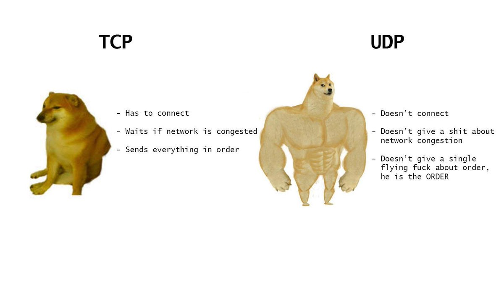

# Purpose

This file is used to track what I learn while working on this project, including my thought process, experiments, mistakes, and insights as my understanding of networking and TCP grows.

## Learning Goals

1. Understand the core ideas behind HTTP and implement parts of the HTTP/1.1 protocol.
2. Learn how internet protocols are built by implementing them from scratch.
3. Develop a deeper understanding of how web applications communicate over TCP/IP.
4. Build strong networking fundamentals relevant to backend and cybersecurity work.

---

# CHAPTER 1: HTTP streams

To simulate how the internet sends data as a stream, I created a simple scenario using a local file (`message.txt`) as the data source.  
I wrote a program that reads the file in fixed-size chunks of 8 bytes and prints each chunk as it is received.

At first, I questioned why such a small buffer size was used, since real-world systems can read much larger amounts of data very quickly.  
This design choice is intentional: using a small buffer makes it easier to observe how stream-based communication works and highlights the fact that data does not arrive as a complete message.

In real-world protocols, data is usually read in larger buffers (for example, 1024 bytes or more) for performance reasons.  
However, regardless of buffer size, an important insight is that a read operation does not guarantee the requested number of bytes — applications must be able to handle partial reads and correctly reconstruct the data.

### Experiments

- changed the buffer size from 8 -> 9 or 10 or more
- observed fewer read calls but same stream behavior

---

# CHAPTER 2: TCP (Transmission Control Protocol)

TCP is one of the core communication protocols of the internet.  
Its main purpose is to provide **reliable, ordered, and error-checked** data transmission between hosts.

For example, if I want to send the message `"Hello, world!"` from one host to another, the data is not sent as a single unit. Instead, it is split into smaller pieces and transmitted across the network.

As the data travels through the network, packets may take different paths and can arrive **out of order**.  
TCP is responsible for reassembling the data in the correct order, detecting missing packets, and requesting retransmission when necessary.

Without a protocol like TCP, there would be no guarantee that the received data is complete or ordered correctly.

> Note:
>
> While studying networking fundamentals, I clarified the difference between packets and frames.
>
> TCP creates segments at Layer 4, which are encapsulated into IP packets at Layer 3.
>
> These packets are then encapsulated into frames at Layer 2 before being transmitted over the network.

## From File Streams to TCP Streams

In earlier experiments, I simulated streaming by reading data from a local file (`message.txt`) in fixed-size chunks.  
In this chapter, I replaced the file-based stream with a real TCP stream using Go’s standard library.

Instead of reading lines from a file, the program now reads data directly from a TCP connection.  
This reinforces the idea that **files and network connections can both be treated as streams**, and that the same read logic applies regardless of where the data originates.

This change helped solidify my understanding that TCP provides a continuous byte stream rather than discrete messages, and that applications are responsible for parsing and reconstructing meaningful data.

## TCP vs UDP

UDP stands for **User Datagram Protocol**.  
TCP and UDP are both **transport-layer protocols**, but they are designed for different use cases.

#### Key Differences

| Feature             | TCP    | UDP    |
| ------------------- | ------ | ------ |
| Connection-oriented | Yes    | No     |
| Handshake           | Yes    | No     |
| Guaranteed order    | Yes    | No     |
| Reliability         | Yes    | No     |
| Performance         | Slower | Faster |

UDP is generally faster because it does not establish a connection, perform a handshake, or guarantee delivery or ordering of packets.

### Conceptual Difference

**TCP** can be thought of as a careful delivery service:  
the sender verifies the receiver, ensures each piece arrives correctly and in order, and retransmits data if something is lost.

**UDP**, on the other hand, simply sends data without checking whether it arrives, arrives in order, or arrives at all.  
The responsibility for handling loss or ordering is left to the application.

## easy to understand memes




> This are the funny ways i understand TCP and UDP differences

### When to Use Each

- TCP: HTTP/HTTPS, file transfers, emails
- UDP: DNS, video streaming, online gaming, VoIP

In this project, I am using `nc` (netcat) as a **TCP sender**.  
Netcat requires a connection to be established between the sender and receiver before any data can be transmitted.

This behavior directly reflects one of TCP’s core properties: it is **connection-oriented**.  
Data is only sent after the TCP handshake is completed, ensuring that both sides are ready to communicate reliably.

## Files vs Network

One important things from this project is that **files and network connection behave very similarly**.
I started by simple reading and writings to files, then updated my code to be a bit more abstract so it can handle both.
From the perspective of my code, files and network connections are both just streams of bytes that you can read from and write to.

The core difference comes down to **pull vs push**:

- **Files (pull):**  
  When reading from a file, I am in control of the process:
  - **When** to read (e.g., when the program runs)
  - **How much** to read (e.g., 8 bytes at a time)
  - **When** to stop reading (EOF)

> Note: With files, you _pull_ the data at your own pace.

- **Network connections (push):**  
  When reading from a network connection, the data is pushed to me by the remote server.  
  I have no control over:
  - When data arrives
  - How much data arrives at a time
  - When the stream ends

I must be ready to receive data whenever it comes and handle it correctly.  
This distinction reinforced my understanding that **network streams are asynchronous and unpredictable**, unlike files which are synchronous and controlled.

# CHAPTER 3: Requests

**HTTP/1.1** is a text based protocol that works over TCP

> Note:
>
> I am following RFC: 9112 and 9110
>
> 9110 is the semantic
>
> 9112 is Message Syntax and Routing

## TCP to HTTP

> Why am I using HTTP and not just TCP?

TCP provides **reliable, ordered, and complete** delivery of bytes between hosts.  
However, TCP does **not tell us what type of data** is being sent — it could be text, an image, a video, or an email. TCP only guarantees that the bytes arrive correctly and in order.

HTTP, on the other hand, is an **application-layer protocol** built on top of TCP.  
It gives us a way to specify **what kind of data** is being sent and received (e.g., text/html, image/png, application/json), and provides **semantic meaning** like requests, responses, headers, and status codes.

In short:

- **TCP** → ensures data is delivered reliably
- **HTTP** → ensures data is meaningful and interpretable by applications

### This is what HTTP requests looks like

```
GET /index.html HTTP/1.1
Host: DevLai.dev
User-Agent: Mozilla/5.0 (Windows; U; Windows NT 5.0; en-US; rv:1.1)
Accept: text/html
```

HTTP allows us to specify a **destination within the server** and provides metadata about the request.

### Breakdown of an HTTP Message

| Part         | Example                    | Description                                                                                                                 |
| ------------ | -------------------------- | --------------------------------------------------------------------------------------------------------------------------- |
| Start-line   | GET /index.html HTTP/1.1   | The first line of the request (or response). It specifies the **HTTP method**, **resource path**, and **protocol version**. |
| Header lines | Host: DevLai.dev           | Zero or more lines containing headers. Headers are key-value pairs providing metadata about the request.                    |
|              | User-Agent: Mozilla/5.0    | Another example of a header line.                                                                                           |
| Blank line   | (empty line)               | Separates headers from the message body. Required even if there is no body.                                                 |
| Message body | (none in this GET request) | Optional. Contains data sent to the server (e.g., JSON, form data).                                                         |

> Both HTTP requests and responses follow this format. Collectively, these are called **HTTP Messages**.

### Key Takeaways

1. **Start-line:** Declares the request or response.
2. **Header lines:** Zero or more lines containing metadata about the message.
3. **Empty line:** Separates headers from the body.
4. **Message body:** Optional data payload.

#### Formal Representation

```
METHOD /resource-path PROTOCOL-VERSION\r\n
field-name: value\r\n
field-name: value\r\n
...\r\n
\r\n
[message-body]
```

## cURL

- stands for client URL
- is a command line tool for making http requests.

# CHAPTER 4: Request Lines

I created a simple test file for request parsing.
In this project, I am not using table-driven tests.

Following ThePrimeagen’s approach, " instead of writing tests for every function, I focus on testing the parts I am unlikely to get right on the first attempt—" especially parsing logic and protocol boundaries.

If, in the future, something becomes unclear or error-prone, I can always add more tests.

## Parsing the Request Line

At this point, I already have code that handles plain-text TCP data.
The next step is to convert that raw text into structured data, while ensuring it conforms to the HTTP/1.1 protocol as defined in RFC 9110 and RFC 9112.

for example, given

```
POST /rice HTTP/1.1
Host: localhost:42069
User-Agent: curl;/7.81.0
Accept: */*
content-length: 17

{"Type": "Basmati"}
```

The HTTP parser should return a struct that looks like this

```
type Request struct {
    RequestLine RequestLine
    Headers     map[string]string
    Body        []byte
}
```

### Goal of This section

The goal of this section is to parse the request start-line correctly, using the server’s raw input and following the HTTP message parsing rules defined in RFC 9112.

```
METHOD SP request-target SP HTTP-version CRLF
```

> Examples

```
POST /rice HTTP/1.1
GET /index.html HTTP/1.1
```

### What I Learned from RFC 9112 Section 3:

- Request line must be: `METHOD SP request-target SP HTTP-version CRLF`
- Methods are case-sensitive (GET not get)
- Only single space (SP) allowed between components
- Must end with `\r\n` (CRLF)
-

## Parsing Strategy

To begin parsing, I created a function called `ParseRequestLine`.

This function:

- Takes the raw request text as a string

- parses the request line

- Returns:
  - A structured RequestLine

  - The remaining unparsed text (headers + body)

  - An error if the request line is invalid

This allows the parser to:

1. Validate protocol correctness early
2. Keep request-line parsing independent from headers and body parsing
3. Fail fast if the request if malformed

> Note:
>
> Request line is composed of three components
>
> - Method
> - RequestTarget
> - HTTPVersion
>
> Components are separated by space and not tabs
>
> The line must end by CRLF( **\r\n** ). Prime calls this “registered nurse”, which is honestly kind of funny

### Validation & Testing

I implemented a parsing method for the request start-line and added targeted tests to validate edge cases, including:

- Ensuring the HTTP method is uppercase
  - Lowercase methods like get are rejected

- Rejecting invalid HTTP versions
  - Only HTTP/1.1 is accepted

- Detecting invalid request-line formats

- Rejecting request lines with more than three components

## Parsing a Stream

TCP (and HTTP over TCP) is a stream-based protocol, not a message-based one.

Data arrives as an ordered stream of bytes, which may be split or combined arbitrarily by the transport layer. TCP guarantees that data is delivered in order, but it does **not** guarantee that application-level messages will be received in complete units.

Therefore, an HTTP parser must handle incomplete reads and incrementally parse incoming data until enough bytes are available to determine a complete structure.

---

### Incomplete vs complete data

Instead of receiving a full HTTP request at once, I might receive only the first few characters:

**Incomplete**

```
GE
```

So, I create a parser that can handle incomplete reads. It must be smart enough to know that parsing is not finished yet and keep reading until it receives the full request line:

**Complete**

```
GET /rice HTTP/1.1

```

---

### Old approach

- `ReadAll()` → parse everything at once
- Works in toy cases, but bad practice for real networking

**Why it’s bad:**

- TCP is a stream, not message-based
- I might get `"GE"` now and `"T /"` later
- I don’t know:
  - how big the request is
  - when it ends
  - how fast it arrives

---

### New approach

- Read small chunks
- Parse incrementally
- Keep parser state

---

### About the `chunkReader` and tests

- `chunkReader` simulates slow / fragmented network reads
- Tests use:
  - `numBytesPerRead: 1`
  - `numBytesPerRead: 3`

- This forces the code to handle:
  - incomplete request lines
  - partial `\r\n`
  - split tokens like `GE` + `T`

The tests are basically saying:

> “If your parser assumes it gets the full line at once, it will fail.”

---

### Parser state (`initialized` / `done`)

- The `Request` struct becomes a small state machine
- Two states for now:
  - `initialized` → still parsing
  - `done` → request line parsed

My understanding: **track the state of the parser** so it knows whether it should keep consuming data or stop.

---

### Buffer and byte tracking

This lesson emphasizes tracking:

- bytes read from the reader
- bytes consumed by the parser
- bytes remaining unparsed in the buffer

I created a buffer with these key points in mind:

- The buffer size (8, 1024, etc.) is **not**:
  - how much data exists
  - how much will be parsed

- It is just:
  - temporary storage for incoming bytes

What really matters is how many bytes were:

- read
- parsed
- left unparsed and shifted forward for the next read\*\*

# Mistakes & Realizations

- Initially assumed each `Read()` returns a full message → wrong, learned TCP is stream-based.
- Thought UDP might be "unreliable" for all small messages → realized some apps handle reliability at the application layer.
- In the third lesson of request, I thought 0 and nil represents failure but it's more like "needs more data"
- Buffer size is not equal to data size
- Parsing is incremental, not "loop through buffer"
- Confused "pull vs push" → really about synchronous (files) vs asynchronous (network) data availability
- Initially said "TCP splits into packets" → learned TCP creates segments, IP creates packets

# Security Insights

- TCP’s connection-oriented nature is reliable, but also vulnerable to SYN flood attacks.
- Partial read handling is important to prevent buffer overflows or request smuggling.

---
